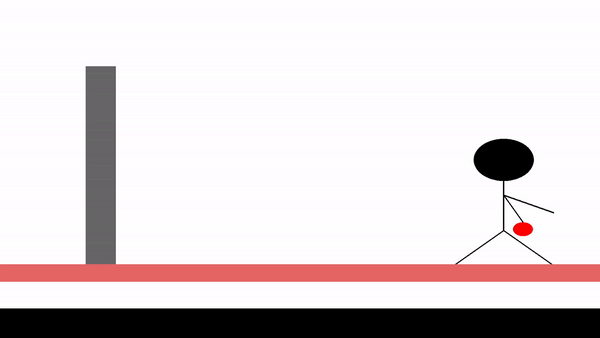

# GFX-Tasks

This repository contains two separate OpenGL tasks, providing hands-on experience.

## Task 1: Getting Started with OpenGL
- [Task 1 README](task-1/README.md)

  

## Task 2: Composing a Scene & Drawing a Leaf
- [Task 2 README](task-2/README.md)

  

    
  

  

    
  

## Task 3: Animate a man throwing a ball.
- [Task 3 README](task-3/README.md)  

  

---

**You can follow the links above to get detailed information for each task. 😊**
