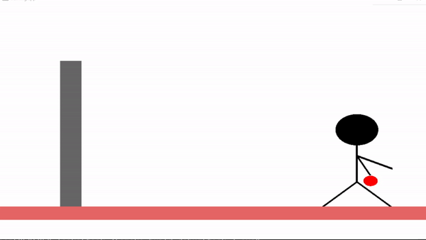
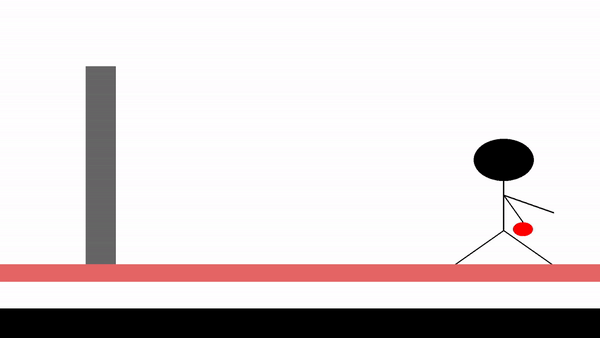
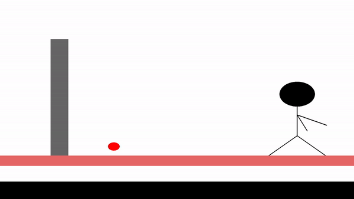

# Animate a man throwing a ball at a wall

In Task 3, we further develop the skills acquired in Tasks 1 and 2 by incorporating additional techniques such as animation, projection, and bouncing into our arsenal.

## 1. Composing the scene

  

Here we can see the man and the wall that the ball will hit and the floor.

## 2. Throwing a ball & Projection

  

In this gif we can see how the man's hand moves while throwing the ball to hit the wall. Also we can see the projection of the ball.

## 3. Bouncing of the ball

  

In this gif we can see how the ball bounces on the floor after the hitting the wall.

## Acknowledgements
This code is provided as a basic example of using OpenGL for Animation. Feel free to modify and expand upon it for your own projects.
