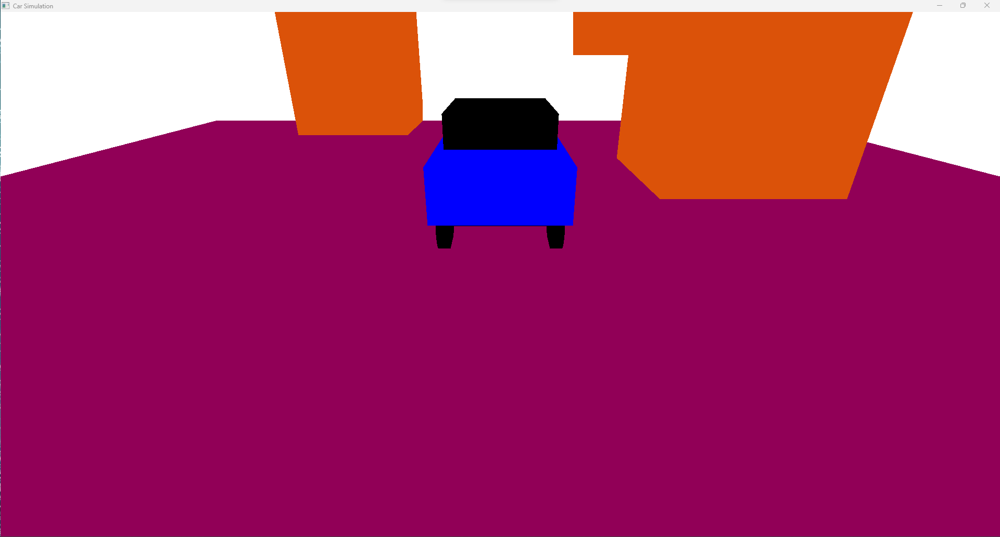

# Drive a Car Throw Obstacles   
___
In Task 4 we enhance our skills by using them to implement a simple game.   
In the game the user drives a car throw obstacles and should avoid crashing them until he reaches the target.

## 1. the Scene of the game
___
Here we can see the first scene of the game.

  

## 2. Detect collision with obstacles.
___
In this gif we can see the car collides with a block.   
the user gets a message indicates that he lost.   
then the game restarts after 3 seconds.   

  

## 3. Detect collision with the target.
___

In this gif we can see the car collides with the target.   
the user gets a messaget that he won the game.  
then the game restarts after 3 secondes.   

  

## Functionalities in the game.
___ 
In these gifs we can see that the user can zoom in or out or return to normal.   
the user can also rotate the camera to the left or the right.   
the user can also move the camera up or down.   

  
  
  

   

___

## Acknowledgements
This code is provided as a basic example of using OpenGL for Animation. Feel free to modify and expand upon it for your own projects.

