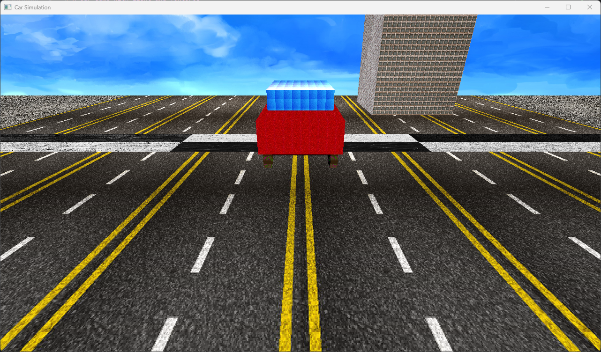

# A Car game with Light and Textures
___
In Task 5 we build on top of task 4 by adding light and shaders to the game.

## 1. Scene after adding light and Textures
___
Here we can see the textures that were added to the blocks and the car

  

## 2. Direction of light.
___
Here we can see that the direction of the light changes if we change the direction of the camere.   

  

## 3. Full Demo of the game.
___

  

___

## Acknowledgements
This code is provided as a basic example of using OpenGL for Animation. Feel free to modify and expand upon it for your own projects.